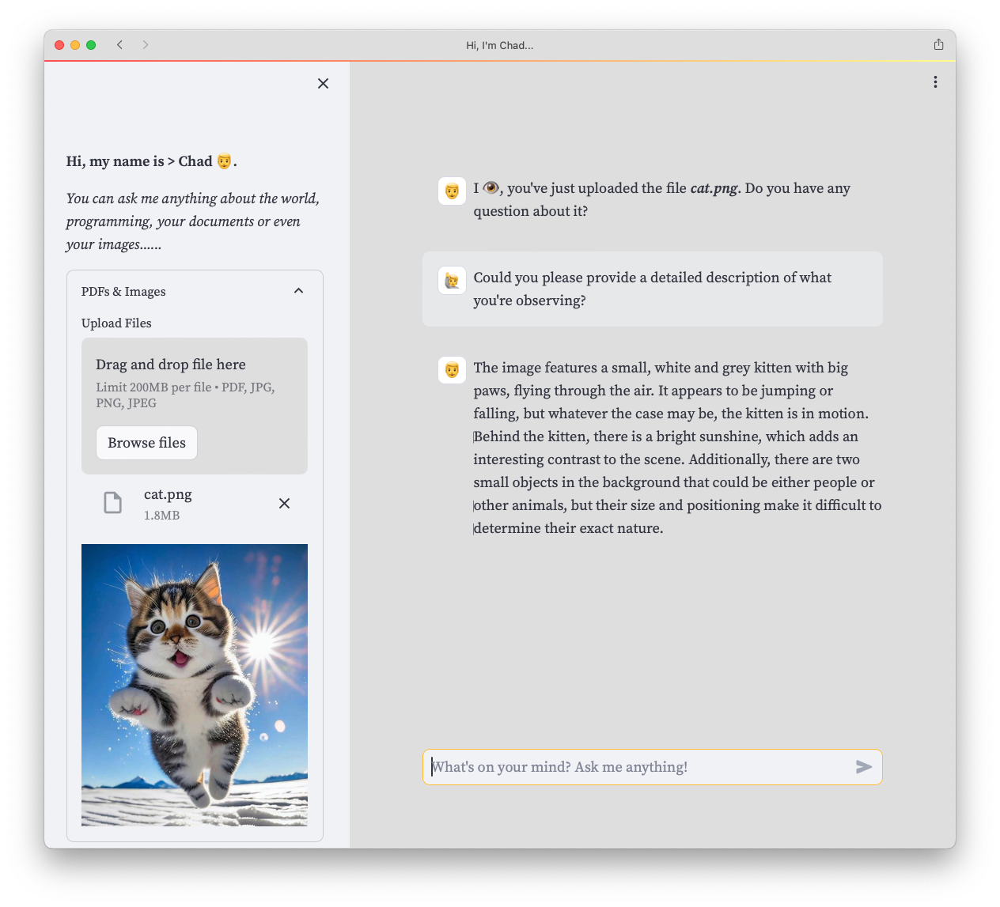
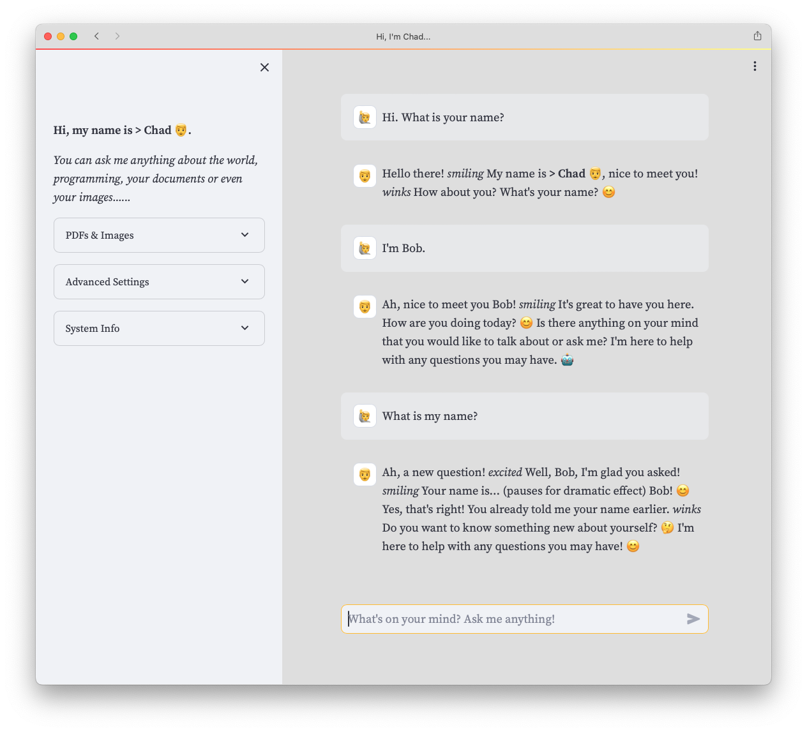
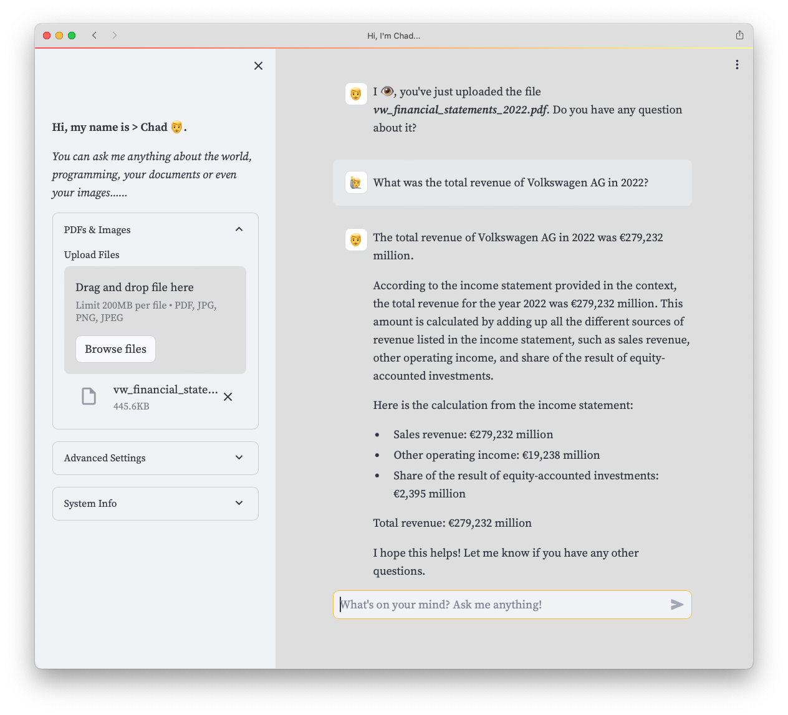
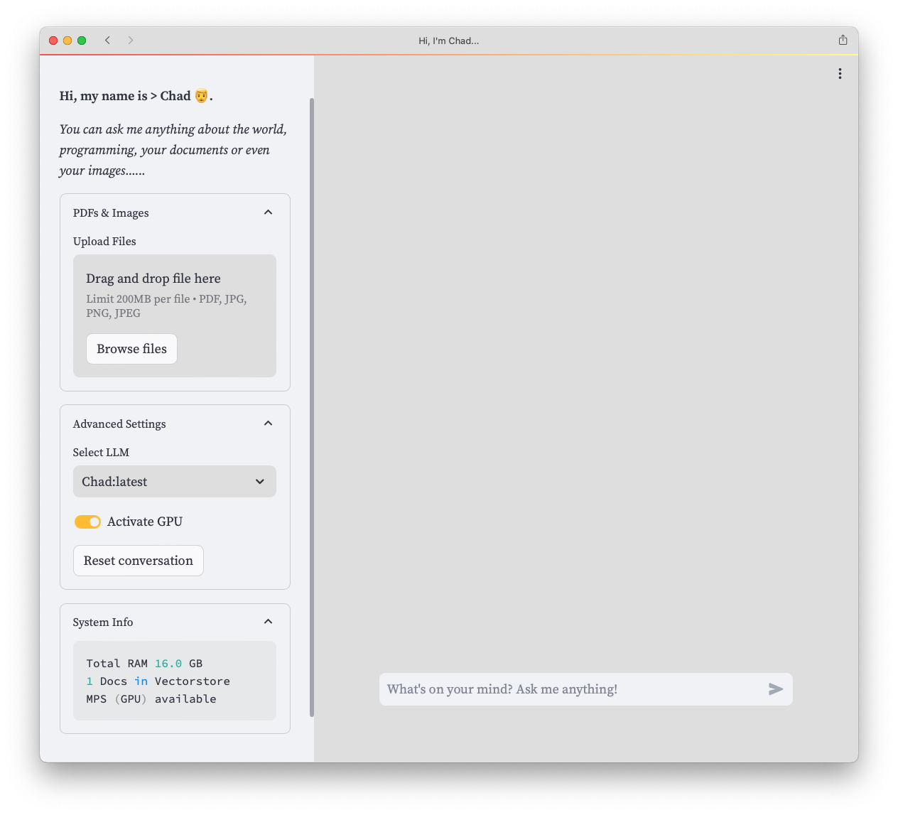

# > Chad 👨*.

_***Hi, my name is Chad. You can ask me anything about the world, programming, your documents or even images...and I am work in progress... ;-).**_



This is a simple web-ui running local LLMs like Lama2, Mistral, Phi 2 via [**Ollama**](https://ollama.ai) on your local machine. It is written in python using the fantastic [**Ollama**](https://ollama.ai) backend with [**LangChain**](https://www.langchain.com) and [**Streamlit**](https://streamlit.io) for the WebUI.

## Features

- Runs 100% on your local machine
- Conversation Types
  - Conversations
  - Documents (RAG)
  - Images (Multi-modal)
- Supports multiple, even unsencored LLMs via Ollama or Huggingface-Hub. 
- Build in converstion memory
- Upload your own PDFs or images to have a conversation with your data
- Simple UI built with Streamlit

## Hardware requirements

- Apple Silicon M1+
- 16 GB RAM

## Screenshots

### Conversation with memory



### Conversation with images


### Conversation with documents



### Settings




## Installation

### Install Ollama

First visit their website and [download](https://ollama.ai/download) 🦙 **Ollama**.

### Download models

```bash
ollama pull llama2
ollama pull bakllama
```

### Clone this repository

```sh
git clone https://github.com/netzwerkerei/Chad.git
```

### Create and activate a virtual evironment using conda

Use the command below to create a virtual environment and install all necessary dependencies.

```sh
cd Chad
conda create -n Chad python=3.10 -y
conda activate Chad
```

### Install dependencies

```sh
pip install --upgrade pip
pip install -r requirements.txt
```

### Run the app

```sh
streamlit run Chad.py
```

### Create and configure your own model and chain settings


- Open Notebook for already installed models `./chad_settings.ipynb`
  - Change default system prompts, tempretures and models per chain

- or get others via huggingface-hub

```sh
pip install huggingface-hub

huggingface-cli download 
  TheBloke/MistralLite-7B-GGUF 
  mistrallite.Q4_K_M.gguf 
  --local-dir downloads 
  --local-dir-use-symlinks False
```

- Create and edit `./Modelfile`

```sh
FROM ./downloads/mistrallite.Q4_K_M.gguf
SYSTEM ...
```

- Create and run model

```sh
ollama create Chad -f Modelfile

ollama run Chad "What is your name?"
```

## License

Copyleft & -right [netzwerkerei@gmail.com](netzwerkerei@gmail.com) 2023.
